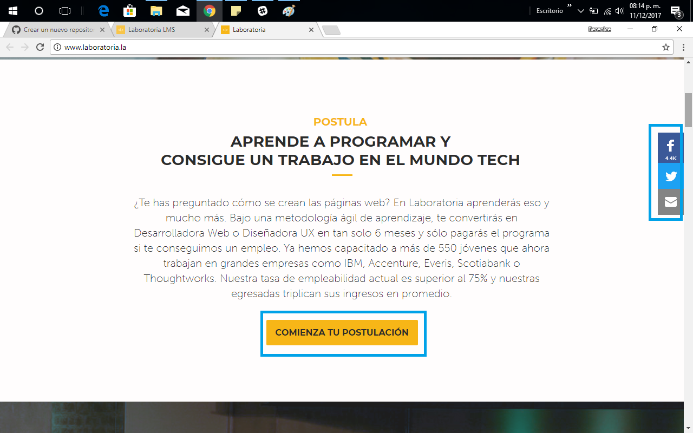
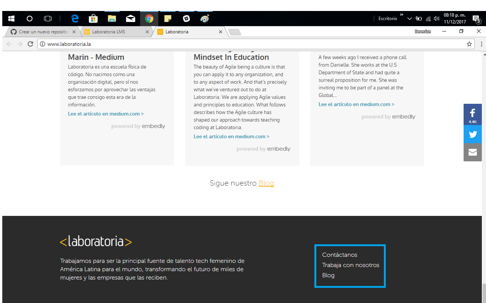
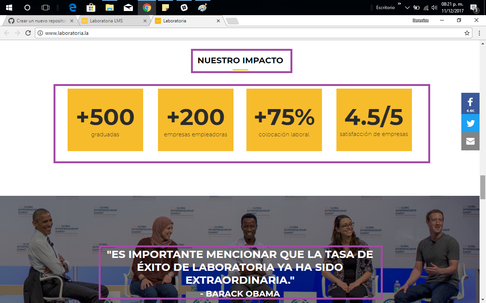

**Elementos UX y UI**

Reto 1:
 Elige una web de tu preferencia y explica qué partes conforman el UX y qué partes el UI de la pagina de Laboratoria.

**Elementos UI**

1.- Uso de los colores distintivos de laboratoria
2.- Botones para estudiantes, empresas y comienza tu postulación.
3.- Links que redireccionan a un block que contiene notas relacionas con el trabajo de Laboratoria
4.- Botón de chat.|
5.- Imágenes que abarcan gran parte de la pantalla y que contienen texto del tamaño y color ideal para que sea legible.
6.-Links para dirigirse a sus redes sociales.
7.- Links para contáctanos y trabaja con nosotros

**links**

 **Elementos UX**

2.- Imagen con graduadas de laboratoria que ocupa gran parte de la pantalla, en la que podemos ubicar en el centro a una mujer sonriente y feliz.
3.- Encontramos la frase talento que transforma en la misma imagen mencionada anteriormente casi a la misma altura de la chica principal de la fotografía.
4.-Seccion de postula donde incluyen información de taza de empreabilidad, nombres de algunas empresas donde podrían trabajar y el tiempo en el que esto sucede.
5.- Encontramos la imagen de una ex alumna con una breve reseña de lo que es su nuevo trabajo, esta imagen da mayor credibilidad a la promesa de un mejor trabajo.
6.- Sección que habla sobre las mujeres que ya son egresadas y que incluye un botón para dirigirse a donde pueden obtener información mas a detalle sobre ellas.
7.- Sección donde invitan a las empresas a saber mas sobre laboratoria y sus egresadas.
8.- Espacio llamado nuestro impacto donde muestran cifras que tienen que ver con el numero de graduadas, empresas que las contratan, satisfacción de las empresas y taza de empleabilidad.
9.-Seccion donde se muestran aliados regionales, reconocimientos y presencia en medios.
10.- Por último, sección en donde se encuentra nuevamente el logo de laboratoria que contiene el contáctanos, trabaja con nosotros y blog.

**links**

